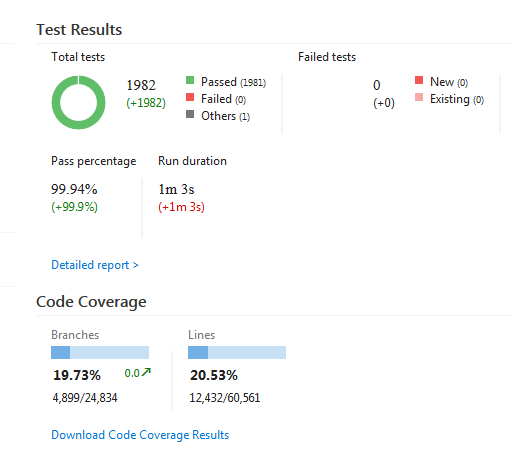

# Run OpenCover with VSTest task

### Overview

This task runs VSTest (`vstest.console.exe`), wrapped with the OpenCover tool to produce code coverage results.
It uses the following tools:

- vstest.console.exe (which must be installed on the build agent computer; see "Advanced Exception Options" below)
- [OpenCover.exe](https://github.com/OpenCover/opencover), a version of which comes packaged with this task.
- [ReportGenerator.exe](https://github.com/danielpalme/ReportGenerator), a version of which comes packaged with this task.
- [OpenCoverToCoberturaConverter.exe](https://github.com/danielpalme/OpenCoverToCoberturaConverter), a version of which comes packaged with this task.

Coverage results are visible in the "Code Coverage" section of a TFS Build summary and detailed information is
added as an attachment for closer inspection.

This task builds upon the VSTest task, which is MIT licensed and available as source [here](https://github.com/Microsoft/vsts-tasks/tree/release/m109/Tasks/VsTest).

#### General Options

Use the following options to select tests and control how the tests are run and how coverage is performed:

- **Sources Directory:** Use this to specify the folder to search for test assemblies.

- **Test Assembly:** This is a required field. Use this to specify one or more test file names from which the tests should be picked. 
	*	Paths are relative to the 'Search Folder' input.
	*	Multiple paths can be specified, one on each line.
	*	Uses the minimatch patterns. Learn more about minimatch [here](https://aka.ms/minimatchexamples)
	
	For example:
	To run tests from any test assembly that has 'test' in the assembly name, `**\*test*.dll`.
	To exclude tests in any folder called `obj`, `!**\obj\**`. 

#### Execution Options

- **Test Filter Criteria:** Filters tests from within the test assembly files. For example, "Priority=1 | Name=MyTestMethod". This option works the same way as the console option /TestCaseFilter of vstest.console.exe

- **Run Settings File:** Path to a runsettings or testsettings file can be specified here. The path can be to a file in the repository or a path to file on disk. Use $(Build.SourcesDirectory) to access the root project folder. [Click here](https://msdn.microsoft.com/library/jj635153.aspx) for more information on these files.

- **OpenCover Filter Criteria:** Filter what should be considered by OpenCover for code coverage. For example, "-\*[\*Tests.\*]".

- **Disable OpenCover:** This allows you to only run the tests and not run OpenCover. Thus, the tasks behaves similar to to stock VSTest task from TFS / VSTS.

#### Advanced Execution Options

- **VSTest version:** Choose which version of Visual Studio (vstest.console.exe) to run tests with. 

- **Path to Custom Test Adapters:** Path to the testadapter for the framework in which the specified tests are written. Provided directory and all subdirectories are checked for testadapters. If there is a packages folder in the sources directory, it is automatically searched for testadapters. As a result, any testadapter downloaded as a Nuget package will be used without any input. For example, ‘$(Build.SourcesDirectory)\Fabrikam\packages’

- **Additional VSTest Options:** Other options that can be provided to vstest.console.exe.

- **Additional OpenConver Options:** Other options that can be provided to OpenCover.Console.exe. For example, `-threshold:1 -skipautoprops`.

- **OpenCover Tools:** Choose which version of OpenCover Tools (OpenCover.exe, ReportGenerator.exe and OpenCoverToCoberturaConverter.exe) is used. Either the version packaged with task, or versions located in a common base directory, which can be specified here.

#### Reporting Options
Use the following options to report desired information for the test run that can be used when analyzing runs. 

- **Test Run Title:** Provide a name for the test run. 

- **Platform:**	Build platform against which the test run should be reported. This field is used for reporting purposes only. If you are using the Build – Visual Studio template, this is already defined for you. For example, x64 or x86. If you have defined a variable for platform in your build task, use that here.

- **Configuration:** Build configuration against which the Test Run should be reported. Field is used for reporting purposes only. If you are using the Build – Visual Studio template, this is already defined for you. For example, Debug or Release. If you have defined a variable for configuration in your build task, use that here.

- **Upload test attachments:** If set, any test run level attachments such as the TRX file will be uploaded.

